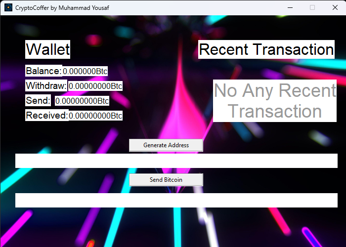

# CryptoCoffer

CryptoCoffer is a simple Bitcoin wallet application developed using Python's Tkinter library. This application allows you to generate a new Bitcoin wallet address and displays the wallet balance, recent transactions, and other wallet-related information.

## Author

- **Muhammad Yousaf**
- Email: yousafsahiwal3@gmail.com

## Features

- Generate a new Bitcoin wallet address
- Display wallet balance
- Display recent transactions
- User-friendly graphical interface

## Prerequisites

- Python 3.x
- Required Python libraries:
  - `tkinter`
  - `bitcoin`
  - `Pillow`

## Installation

1. **Clone the Repository**
   
   ```sh
   git clone https://github.com/iamproprogramr/CryptoCoffer-crypto-wallet.git
   cd CryptoCoffer-crypto-wallet
   ```

2. **Install Required Libraries**
   
   You can install the required Python libraries using pip:

   ```sh
   pip install bitcoin Pillow
   ```

3. **Prepare Resources**
   
   Ensure you have the `background.png` and `bitcoin.ico` files in the same directory as the script. You can place your own images or download them as needed.

## Usage

1. **Run the Script**

   ```sh
   python CryptoCoffer.py
   ```

## Expected Output

Upon running the script, a window will appear with the following features:

- **Background Image**: The window will have a background image.
- **Wallet Information**:
  - Wallet balance
  - Recent withdrawals
  - Recent sent transactions
  - Recent received transactions
- **Generate Address Button**: A button to generate a new Bitcoin wallet address.
- **Send Bitcoin**: A section to send Bitcoin.


## Screenshots

### Main Window


## License

This project is licensed under the MIT License. See the [LICENSE](LICENSE) file for details.

## Contact

For any questions or suggestions, please contact Muhammad Yousaf at yousafsahiwal3@gmail.com.


